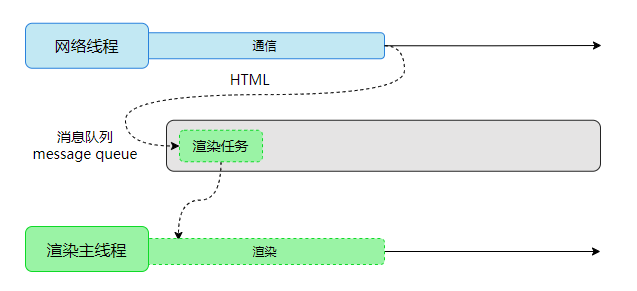
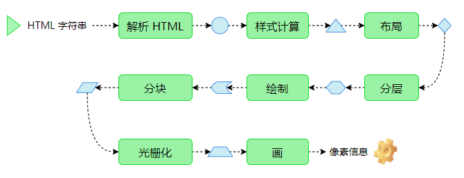
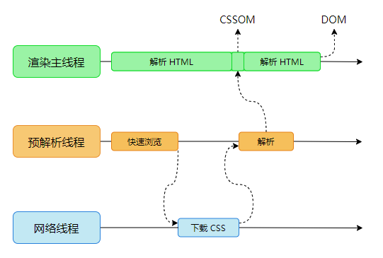
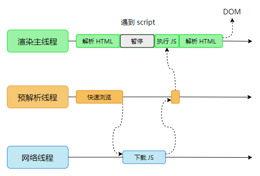
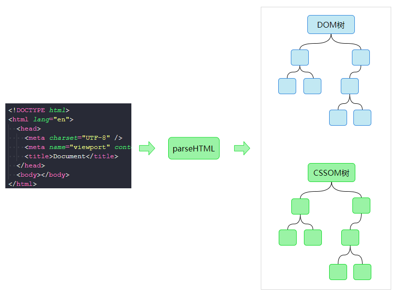
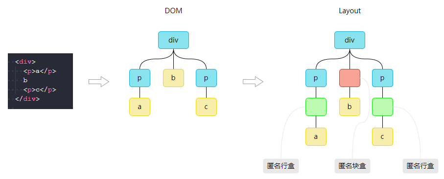
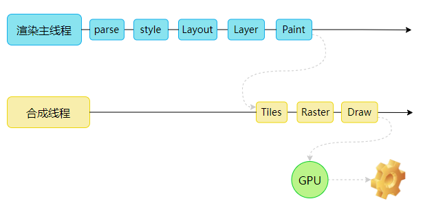
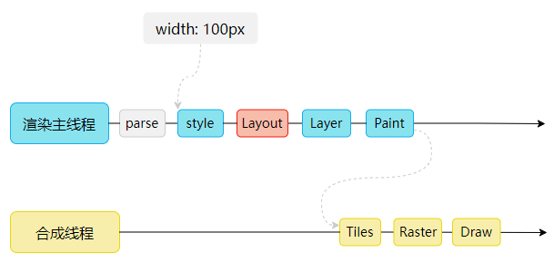
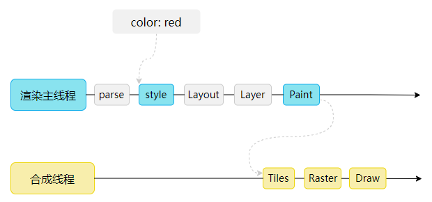

<h1>浏览器渲染原理</h1>

## 浏览器是如何渲染页面的？

当浏览器的网络线程收到 HTML 文档后，会产生一个渲染任务，并将其传递给渲染主线程的消息队列。

在事件循环机制的作用下，渲染主线程取出消息队列中的渲染任务，开启渲染流程。

---
整个渲染流程分为多个阶段，分别是：HTML解析、样式解析、布局、分层、绘制、分块、光栅化、画

每个阶段都有明确的输入输出，上一个阶段的输出会成为下一个阶段的输入。

这样，整个渲染流程就形成了一套组织严密的生产流水线。

---

渲染的第一步是解析 **HTML**

解析过程中遇到 CSS 则解析 CSS，遇到 JS 则执行 JS。为了提高解析效率，浏览器在开始解析前，会启动一个预解析的线程，率先下载 HTML 中的外部 CSS 文件和外部 JS 文件。

如果主线程解析到`link`标签，此时外部的 CSS 文件还没有下载解析好，主线程不会等待，继续解析后续的 HTML。这是因为下载和解析 CSS 的工作是在预解析线程中进行的。这就是 CSS 不会阻塞 HTML 解析的根本原因。

如果主线程解析到`script`标签，会暂停解析 HTML，转而等待 JS 文件下载好，并将全局代码解析执行完成后，才能继续解析 HTML。这是因为 JS 代码的执行过程可能会修改当前的 DOM 树，所以 DOM 树的生成必须暂停。这就是 JS 会阻塞 HTML 解析的根本原因。

在第一步完成后，会得到DOM 树和 CSSOM 树，浏览器的默认样式、内部样式、外部样式、行内样式均会包含在 CSSOM 树中。

---

渲染的下一步是**样式计算**

主线程会遍历得到的 DOM 树，依次为树中的每个节点计算出它最终的样式，称之为`Computed Style`

在这一过程中，很多预设值会变成绝对值，比如`red`会变成`rga(255,0,0)`；相对单位会变成绝对单位，比如`em`会变成`px`

这一步完成后，会得到一棵带有样式的 DOM 树

---

接下来是**布局**，布局完成后会得到布局树

布局阶段会依次遍历 DOM 树的每一个节点，计算每个节点的几何信息。例如节点的宽高、相对包含块的位置。

大部分时候，DOM 树和布局树并非一一对应

比如`display:none`的节点没有几何信息，因此不会生成到布局树；又比如使用了伪元素选择器，虽然 DOM 树中不存在这些伪元素节点，但它们拥有几何信息，所以会生成到布局树中。还有匿名行盒、匿名块盒等等都会导致 DOM 树和布局树无法一一对应

---

下一步是**分层**

主线程会使用一套复杂的策略对整个布局树进行分层

分层的好处在于，将来某一个层改变后，仅会对该层进行后续处理，从而提升效率

滚动条、堆叠上下文、`transform`、`opacity`等样式都会或多或少的影响分层结果，也可以通过`will-change`属性更大程度的影响分层结果

---

再下一步是**绘制**

主线程会为每个层单独产生绘制指令集，用于描述这一层的内容该如何画出来，渲染主线程的工作到此为止，剩余步骤交给其他线程来完成

---

完成绘制后，下一步是**分块**，主线程将每个图层的绘制信息提交给**合成线程**，剩余工作将由合成线程来完成

合成线程首先对每个图层进行分块，将其划分为更多的小区域

它会从线程池中拿取多个线程来完成分块工作

---

分块完成后，进入**光栅化**阶段

合成线程会将块信息交给 GPU 进程，以极高的速度完成光栅化

GPU 进程会开启多个线程来完成光栅化，并且优先处理靠近视口区域的块

光栅化的结果，就是一块一块的位图

---

最后一个阶段就是**画**了

合成线程拿到每个层、每个块的位图后，生成一个个「指引（quad）」信息

指引会标识出每个位图应该画到屏幕的哪个位置，以及会考虑到旋转、缩放等变形

变形发生在合成线程，与渲染主线程无关，这就是`transform`效率高的本质原因

合成线程会把 quad 提交给 GPU 进程，由 GPU 进程产生系统调用，提交给 GPU 硬件，完成最终的屏幕成像

---

完整过程

---

## 什么是`reflow`？

`reflow`的本质就是重新计算「布局树」

当进行了会影响布局树的操作后，需要重新计算布局树，会引发 layout

为了避免连续的多次操作导致布局树反复计算，浏览器会合并这些操作，当 JS 代码全部完成后再进行统一计算。所以，改动属性造成的`reflow`是异步完成的

也同样因为如此，当 JS 获取布局属性时，就可能造成无法获取到最新的布局信息

浏览器在反复权衡下，最终决定获取属性立即`reflow`

## 如何避免不必要的`reflow`

- 样式表越简单、重排和重绘就越快
- 重排和重绘的DOM元素层级越高，成本越高
- table元素重排和重绘的成本要高于div
- 统一改样式
- 尽量不要将读取和写入的操作放在同一条语句里面
- 缓存重排结果
- 虚拟DOM React
- `display:none`不会影响重排重绘
- `visibility`影响重排不影响重绘

## 什么是`repaint`？

`repaint`的本质就是重新根据分层信息计算了绘制指令

当改动了可见样式后，就需要重新计算，会引发`repaint`

由于元素的布局信息也属于可见样式，所以`reflow`一定会引起`repaint`

## 为什么`transform`的效率高？

因为`transform`既不会影响布局也不会影响绘制指令，它影响的只是渲染流程的最后一个「**Draw**」阶段

由于`draw`阶段在合成线程中，所以`transform`的变化几乎不会影响渲染主线程。反之，渲染主线程无论如何忙碌，也不会影响`transform`的变化

### 有很多属性和方法会触发`layout`

`clientHeight`、`clientleft`、`clientTop`、`clientWidth`、`focus()`、`getBoundingClientRect()` `getClientRects()`、`innerText`、`offsetHeight`、`offsetLeft`、`offsetParent`、`offsetTop`、`offsetWidth`、`outerText`、`scrollBylines()`、`scrollBypages()`、`scrollHeight()`、`scrollIntoViev()`、`scrollIntoVievNeeded()`、`scrollLeft`、`scrollTop`、`scrollWidth`......

**提高动画性能，则尽量不触发`layout`，使用`transform`，读取以上属性不会触发`layout`、只有更改的时候才会触发**

