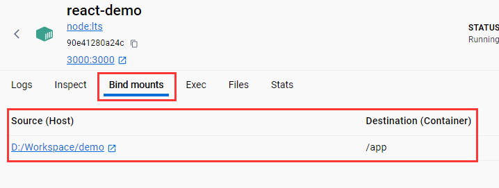

# docker 搭建远程开发环境

!> 如果在 Windows 上还没搭建好基础的 docker 运行环境的话，去这里看：[启用 Windows 的 WSL 功能](misc/win10开发环境搭建?id=启用-windows-的-wsl-功能)和[安装 Docker](misc/win10开发环境搭建?id=安装-docker)

今夕是何年，你还在 Windows 环境上做本地开发？ 以后的趋势是在 docker 上进行远程开发了，因为这样可以统一项目中所有人员的开发环境

在前端开发环境中，我们需要全局安装的软件至少有`node、git、typescript、@vue/cli或者create-react-app`

#### 先来个简单的

比如我已经在宿主机的`D:/Workspace/demo`目录下使用`create-react-app`创建了一个干净的项目，这时我想在 docker 容器中开发这个项目

1. 首先执行`docker pull node:lts`下载一个 node 环境镜像
2. 接着使用这个 node 镜像启动一个容器，并且将宿主机的`D:/Workspace/demo`目录映射到容器中的`/app`目录

```sh
docker run -dit -p 3000:3000 -e WATCHPACK_POLLING=true --name react-demo -v "${PWD}":/app node:lts
```

上面这个命令的参数说明

- `-dit`：后台运行且分配一个命令行交互终端
- `-p`：端口映射
- `-e`：设置环境变量，我这里是让 docker 容器中的项目支持热更新，如果是 React 18 之前的项目则为`-e CHOKIDAR_USEPOLLING=true`
- `--name`：指定容器名称
- `-v`：将宿主机的目录挂载到容器中
- `node`：以 node 镜像为基础启动容器

上面的命令执行成功后，可以在`Docker Desktop`中查看该容器的相关信息，可以看到宿主机的项目目录已经成功挂载到容器中



3. 打开 VSCode 先点击左下角，然后再弹出的对话框中选择`附加到正在运行的容器`，选择对应的容器(我这里是`react-demo`)


4. 在 VSCode 中打开命令行终端，输入`cd /app`进入到容器中的开发目录，执行`npm install`安装依赖，最后`npm run start`就可以愉快的开发了

#### 制作项目所需的开发环境镜像

1. 还是在宿主机的`D:/Workspace/demo`目录下，在目录创建一个`Dockerfile`文件，内容如下：

```sh
# 以node镜像作为基础
FROM node:lts
# 设置工作目录
WORKDIR /app
RUN apt-get update -y && \
 apt-get upgrade -y && \
 apt-get install -y \
 curl \
 git && \
 rm -rf /var/lib/apt/lists/*
# 安装一些全局依赖
RUN npm install typescript nodemon ts-node live-server -g --registry=https://registry.npm.taobao.org
```

2. 构建镜像`docker image build -t my-node .`，然后运行容器`docker run -dit -p 5173:5173 --name vue-demo -v "${PWD}":/app my-node sh`

3. 接着用 VSCode 进入容器开发环境，在`/app`目录下安装 Vue 项目(_宿主机挂载的目录会自动同步文件_)，安装完成后修改一下`vite.config`，添加以下配置

```ts
server: {
  host: '0.0.0.0', // 允许宿主机访问容器内的地址
  hmr: true,
  // 开启热更新
  watch: { usePolling: true }
}
```

4. 最后`npm run dev`就能愉快的在容器中进行开发了
