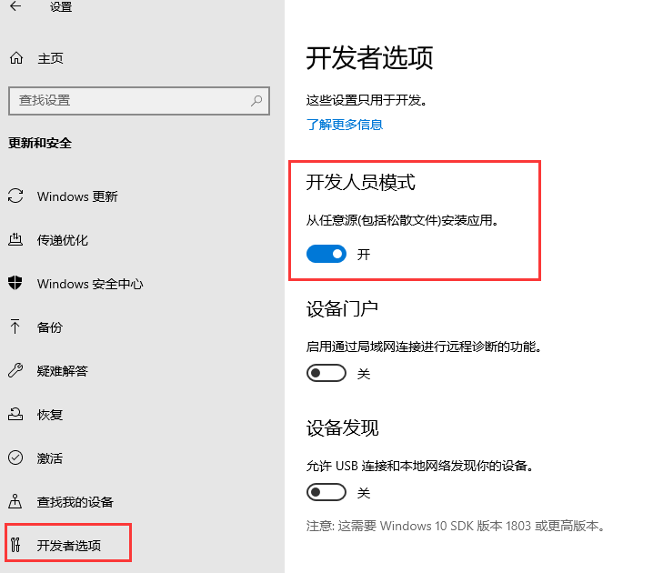
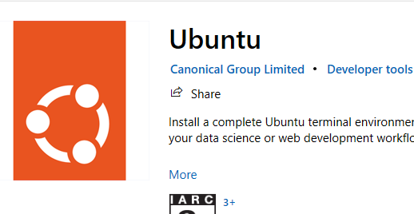

# 我的 Win10 开发环境搭建

!> 在 Windows 系统中，我平时习惯将开发软件安装在`D`盘的`Develop`目录下

## 可能用到的软件

- [Android Studio](https://developer.android.com/studio)
- [宝塔面板](https://www.bt.cn/new/download.html)
- [Dart](http://gekorm.com/dart-windows/)
- fvm
- [git](https://git-scm.com/downloads)
- [TortoiseGit](https://tortoisegit.org/download/)
- [JDK](https://www.oracle.com/hk/java/technologies/downloads/#java17)
- [Microsoft VS Code](https://code.visualstudio.com/Download)
- [Microsoft Visual Studio](https://visualstudio.microsoft.com/downloads/)
- [nvm](https://github.com/coreybutler/nvm-windows)
- [Notepad++](https://github.com/notepad-plus-plus/notepad-plus-plus)
- Navicat Premium
- [Python](https://www.python.org/downloads/)
- XshellXftpPortable

## 启用 Win10 的子系统功能

!> 可以通过在 PowerShell 执行`wsl --install`命令进行 WSL 的初始化安装，默认会安装 Ubuntu 作为 Linux 子系统，此时会自动更新到 WSL2。输入`wsl -l -o`可以查看官方提供的 Linux 发行版列表

**下面讲讲手动设置 WSL2 的方式**

1. 启用 win10 的开发者模式



2. 打开控制面板的`Windows功能`并勾选`适用于Linux的Windows子系统`和`虚拟机平台`，点确定后会要求重启电脑


3. 下载[WSL2 Linux](https://wslstorestorage.blob.core.windows.net/wslblob/wsl_update_x64.msi)内核更新包并安装
4. 将 WSL2 设置为默认版本`wsl --set-default-version 2`
5. 在 Win10 应用商店搜索`Ubuntu`，然后安装它，也可以通过命令`wsl --install -d Ubuntu`来安装



?> 如果之前已经安装了 WSL1 版本的子系统，那么在上述第 4 步之后再执行`wsl --set-version Ubuntu 2`命令将子系统更新到 WSL2

安装完成后根据提示设置系统用户名和密码，输入`sudo passwd`来初始化`root`用户的密码，会提示输入当前系统用户的密码，接着才是设置`root`用户的密码，要输入两次。之后如果想切到`root`用户的话就键入`su`

#### 将 apt 更换为[阿里源](https://developer.aliyun.com/mirror/ubuntu)

切到`root`用户，使用顺手的编辑器修改文件`vim /etc/apt/sources.list`，将所有链接替换为`https://mirrors.aliyun.com/ubuntu/`

可以使用`vim`的替换命令进行批量修改，例如：`:%s#http://cn.archive.ubuntu.com#https://mirrors.aliyun.com#g`

接着输入`apt-get update`刷新源信息

!> 子系统和 win10 是使用的相同网络，端口也都是共用的，避免端口占用冲突

如果要在 Windows 的文件资源管理器中查看 Linux 的文件的话，只需在地址栏中输入`\\wsl$`即可打开 Linux 的文件系统

#### WSL 端口映射

在 windows10 中，由于每次重启宿主机后，WSL 虚拟机的 ip 地址有可能会发生变化，所以需要重新映射，在 PowerShell 中执行

```sh
netsh interface portproxy add v4tov4 listenaddress=0.0.0.0 listenport=win10端口 connectaddress=虚拟机的ip connectport=虚拟机的端口
```

检查是否映射成功`netsh interface portproxy show all`

在 Ubuntu 中查看 ip 地址的命令是`ifconfig`，其中`eth0`中的`inet`就是虚拟机的 ip 地址

#### SSH 配置

在新安装的 Ubuntu 中把`openssh-server`给卸载了，因为它预装的可能不完整，需要重新安装一下，切到`root`用户

```sh
apt remove openssh-server
apt install openssh-server
```

接着来修改 ssh 的配置，在终端输入`vim /etc/ssh/sshd_config`，修改或增加以下几个配置项(_根据自己的喜好设置端口_)

```sh
Port 2233
ListenAddress 0.0.0.0
LoginGraceTime 2m
StrictModes yes
PermitRootLogin yes
PasswordAuthentication yes
```

修改完毕后重启 ssh 服务`service ssh --full-restart`

上面提到，每次重启宿主机会导致 WSL 的 ip 地址变化，所以这里要做一下映射，回到宿主机执行端口映射(_根据自己的情况填写虚拟机的 ip 地址_)

```sh
netsh interface portproxy add v4tov4 listenaddress=0.0.0.0 listenport=2233 connectaddress=172.18.242.131 connectport=2233
```

如果遇到端口被防火墙拦截的情况，需在宿主机的 PowerShell 中执行

```sh
netsh advfirewall firewall add rule name=WSL2 dir=in action=allow protocol=TCP localport=2233
```

!> 如果在使用`Xshell`连接时提示`找不到匹配的key exchange算法`或`找不到匹配的host key算法`，更新`Xshell`到一个比较新的版本就好了，因为服务端的`openssh-server`加密算法太新了

#### WSL 设置代理

1. 临时设置代理，这种方式设置的代理仅在当前终端生效，关闭当前终端后就会恢复之前的环境变量。这里，因为我的宿主机 Windows 用的是 Clash，宿主 IP 地址为`192.168.5.10`，端口为`7890`，所以在终端输入

```sh
export http_proxy="http://192.168.5.10:7890"
export https_proxy="http://192.168.5.10:7890"
```

!> Clash 要记得打开`Allow LAN`模式，因为 Ubuntu 和宿主机之间其实是属于局域网

2. 修改`.bashrc`文件，这种方式对当前用户永久生效。先在终端输入`cd ~`回到用户根目录，接着输入`vim .bashrc`，然后在文件末尾添加以下两行后保存退出，最后在终端输入`source .bashrc`重载配置使其生效

```sh
export http_proxy="http://192.168.5.10:7890"
export https_proxy="http://192.168.5.10:7890"
```

3. 修改`/etc/profile`文件，这种方式对所有用户永久生效。在终端输入`vim /etc/profile`，接着在文件末尾添加以下两行后保存退出，最后需要通过`reboot`重启系统来使配置生效

```sh
export http_proxy="http://192.168.5.10:7890"
export https_proxy="http://192.168.5.10:7890"
```

---

## 在子系统中安装宝塔

切到`root`用户执行命令

```sh
wget -O install.sh https://download.bt.cn/install/install-ubuntu_6.0.sh && sudo bash install.sh ed8484bec
```

安装完成后会在终端输出面板的登录信息，记得保存下来，内网地址的可以替换成`127.0.0.1`也是可以打开面板的，外网地址的那个不用管，反正家庭宽带的公网 IP 也是假的

!> 接下来安装运行环境的软件时一定要记得选**编译安装**

创建工作区的软链接，比如我 Windows 系统中的代码是存放在是`D:/Workspace`，里面有一个前端项目`test`，那么在子系统中的软链接为

```sh
sudo ln -s /www/wwwroot/test /mnt/d/Workspace/test
```

?> 上面的`/mnt`可以理解成是`windows`系统，然后`/d`表示 D 盘，后面的文件夹就很好理解了，不再展开说明

#### 设置宝塔面板跟随 Windows 开机自启

1. 在 Ubuntu 中创建一个脚本`sudo vim /etc/init.wsl`，内容如下

```sh
#! /bin/bash
bt start
/etc/init.d/nginx start

#注: 因为wsl2中的Ubuntu不能自启软件,所以才这么搞; 然后你发现宝塔自启后, nginx等服务还是不会自启, 可以把相应服务的启动指令同样放在这里来解决
```

2. 给该脚本添加执行权限`sudo chmod +x /etc/init.wsl`
3. 在 Windows 中创建一个 vbs 脚本文件并命名为`ubuntu_start.vbs`，内容如下

```vb
Set ws = WScript.CreateObject("WScript.Shell")
ws.run "wsl -u root /etc/init.wsl", vbhide
```

4. 按`Win+R`键打开运行，输入`shell:startup`，把`ubuntu_start.vbs`拖到启动文件夹里，这样每次 Windows 启动时就会自动执行`init.wsl`脚本了

---

## git 和 TortoiseGit 的配置

先去下载[git](https://git-scm.com/downloads) 和 [TortoiseGit](https://tortoisegit.org/download/)，具体的安装步骤就不说了，百度一搜各种各样的都有，这里主要讲我对 git 的环境变量配置

安装完成后打开 TortoiseGit 设置，并修改其 SSH 客户端为`D:\Develop\Git\usr\bin\ssh.exe`

给用户变量`Path`增加以下两个值`D:\Develop\Git\cmd`和`D:\Develop\TortoiseGit\bin`

接着给 git 设置用户名和邮箱，具体的邮箱地址我就不放出来了，避免泄漏

```sh
git config --global user.name Jandan
git config --global user.email ***@gmail.com
```

生成公钥，输入指令后无脑按回车就行

```sh
ssh-keygen -m PEM -t ed25519 -C "***@gmail.com"
```

打开 github 网站，进入设置，填入刚才生成的`ssh key`，如果是首次和 github 建立连接，则输入`ssh -T git@github.com`创建连接信息

对于使用 http 方式连接远程仓库的，输入以下指令用来保存账号和密码

```sh
git config credential.helper store
```

---

## nvm 和 nodejs 的配置

#### Ubuntu 中安装 [nvm](https://github.com/nvm-sh/nvm)

1. 命令行中执行`curl -o- https://raw.githubusercontent.com/nvm-sh/nvm/v0.39.5/install.sh | bash`，脚本运行结束后打开一个新的终端窗口，输入`nvm -v`查看是否安装成功
2. 查看所有可用的 node 版本`nvm ls-remote`
3. 安装 LTS 版本的 node，`nvm install --lts`，安装后会自动切到这个版本

#### Windows 中安装 nvm

先去 Github 下载[nvm](https://github.com/coreybutler/nvm-windows)

设置安装目录为`D:\Develop\nvm`


设置 nodejs 软链接指向的目录为`D:\Develop\nvm\nodejs`，之后就无脑下一步


安装完成后会自动生成两个系统环境变量`NVM_HOME`和`NVM_SYMLINK`

然后使用 nvm 命令安装所需要的 nodejs 版本，我这里安装的是最新的 LTS 版本

```sh
nvm install 18.17.1
nvm use 18.17.1
```

接着在 nvm 安装目录下新建如下几个文件夹

- `node_global`
  - `node_modules`
- `node_cache`
- `Yarn`
  - `Global`
  - `Cache`

创建好上述几个文件夹后开始接着补环境变量

```sh
Path => %NVM_HOME%\node_global
NODE_PATH => %NVM_HOME%\node_global\node_modules
```

修改 npm 的缓存目录、全局包存放目录和设置淘宝源

```sh
npm config set prefix "D:\Develop\nvm\node_global"
npm config set cache "D:\Develop\nvm\node_cache"
npm config set registry https://registry.npm.taobao.org
```

安装 yarn

```sh
npm i -g yarn
```

修改 yarn 的缓存目录和全局包存放目录

```sh
yarn config set global-folder "D:\Develop\nvm\Yarn\Global"
yarn config set cache-folder "D:\Develop\nvm\Yarn\Cache"
```

我常用的 npm 全局包

- yarn
- ts-node
- whistle
- nodemon
- pm2
- live-server
- prisma
- appium
- appium-doctor
- docsify-cli
- eas-cli
- @vue/cli
- @tarojs/cli
- @nestjs/cli
- @ant-design/pro-cli

?> 至此，nvm 和 nodejs 的环境配置结束

---

## JDK 配置

1. 根据所安装的 JDK 版本，新建一个带有大版本号的用户变量，例如`JAVA17_HOME`，变量值填入安装路径`D:\Develop\Java\jdk-17`
2. 再新建一个用户变量`JAVA_HOME`，变量值填入`%JAVA17_HOME%`。如果安装有多个 JDK 版本时，只需要修改`JAVA_HOME`变量的值即可切换全局的 JDK 版本，例如修改为`%JAVA11_HOME%`
3. 给用户变量`Path`添加一个值`%JAVA_HOME%\bin`

---

## Android Studio 配置

安装 Android Studio 并下载所需要的相关 SDK 后可以选择设置全局环境变量也可以给某个 Flutter 版本设置局部环境变量：

- 全局环境变量
  1. 新建用户变量`ANDROID_HOME`和`ANDROID_SDK_ROOT`，变量值填入`D:\Develop\Android\Sdk`
  2. 新建用户变量`ANDROID_SDK_HOME`，变量值填入`D:\Develop\Android\AVD`，这个是设置虚拟机路径
  3. 给用户变量`Path`添加以下值`%ANDROID_HOME%`、`%ANDROID_SDK_HOME%`、`%ANDROID_HOME%\platform-tools`、`%ANDROID_HOME%\emulator`、`%ANDROID_HOME%\tools`和`%ANDROID_HOME%\tools\bin`
- Flutter 局部环境变量
  1. 给用户变量`Path`添加`%ANDROID_HOME%\platform-tools`
  2. 接着在命令行终端输入`flutter config --android-sdk D:\Develop\Android\Sdk`

由于 gradle 的默认缓存目录是在 C 盘，所以需要更改到其他位置，新建用户变量`GRADLE_USER_HOME`，变量值填入`F:\AndroidStudioCache\.gradle`

!> 新安装 Android Studio 时，由于 jre 目录的文件不完整，需要把整个 jre 目录删除，然后在软件根目录下执行命令 mklink /D "jre" "jbr"创建一个软链接即可

一些常用的安卓模拟器命令

- 查看安装有哪些安卓模拟器：`emulator -list-avds`
- 修改安卓模拟器的 dns 网关地址，实现模拟器联网：`emulator -avd 模拟器名 -dns-server 局域网网关`

---

## Dart、fvm、Flutter 的安装配置

先去下载[Dart](http://gekorm.com/dart-windows/)

设置安装目录为`D:\Develop\Dart`


安装完后会自动生成一个系统环境变量`DART_SDK`，然后给用户变量`Path`添加一个值`%DART_SDK%\bin`

下载 fvm

```sh
dart pub global activate fvm
```

再给用户变量`Path`添加一个值`%LOCALAPPDATA%\Pub\Cache\bin`

创建一个系统变量`FVM_HOME`，填入值`D:\Develop\fvm`，然后使用命令修改 fvm 的缓存路径

```sh
fvm config --cache-path D:\Develop\fvm
```

!> 注意：由于 fvm 是 bat 脚本，需要在 cmd 或 powershell 中才能执行

查看所有可用的 flutter 版本`fvm releases`

下载安装某个 flutter 版本，这里以 3.13.4 为例：`fvm install 3.13.4`

设置已下载的某个 flutter 版本作为全局，`fvm global 3.13.4`

设置了全局版本之后，会在`D:\Develop\fvm`目录下自动生成一个`default`目录，其将作为软链接指向某个具体的版本

然后给用户变量`Path`添加一个值`%FVM_HOME%\default\bin`

最后创建两个用户环境变量`FLUTTER_STORAGE_BASE_URL`和`PUB_HOSTED_URL`

```sh
FLUTTER_STORAGE_BASE_URL => https://storage.flutter-io.cn
PUB_HOSTED_URL => https://pub.flutter-io.cn
```

?> 更多 fvm 命令可以查看[官方文档](https://fvm.app/docs/guides/basic_commands)

!> 在运行`flutter doctor`进行环境检查时，如果提示 `HTTP Host Availability`，则按以下处理：

- 打开`flutter\packages\flutter_tools\lib\src\http_host_validator.dart`文件
- 修改`kPubDevHttpHost`的值为`https://pub.flutter-io.cn/`
- 修改`kgCloudHttpHost`的值为`https://storage.flutter-io.cn/`
- 修改`androidRequiredHttpHosts`的值为`https://maven.aliyun.com/repository/google/`

?> 至此，Dart、fvm 和 flutter 的环境配置结束

---
