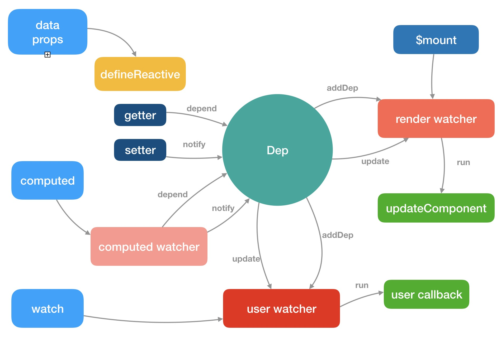

<center><h1>Vue2响应式原理</h1></center>

> 首先要知道 Vue2 是2013年基于 ES5 开发出来的，我们常说的重渲染就是重新运行`render`函数
>
> Vue2 的响应式原理是利⽤ ES5 的⼀个API，`Object.defineProperty`对数据进⾏劫持结合发布订阅模式的⽅式来实现的

## 思路

带入作者的角度思考一下，想要达成响应式的特点应该是：**属性更新，自动调用依赖的函数**进行重新渲染

1. 使用属性描述符`Object.defineProperty`监听属性的赋值
2. 赋值完成后调用依赖该属性的函数，那如何获取依赖的函数呢？看第三点
3. 由于依赖会调用属性的`get`方法，所以可以在`get`方法中「**依赖收集**」
4. 然后在set方法中执行这些依赖的函数，称为「**派发更新**」


## 原理

Vue2 响应式原理简单来说就是Vue官网上的这图片



通过`Object.defineProperty`遍历对象的每一个属性，把每一个属性变成一个`getter`和`setter`函数，读取属性的时候调用`getter`，给属性赋值的时候就会调用`setter`


当运行`render`函数的时候，发现用到了响应式数据，这时候就会运行`getter`函数，然后`watcher`（发布订阅）就会记录下来。当响应式数据发生变化的时候，就会调用`setter`函数，`watcher`就会再记录下来这次的变化，然后通知`render`函数，数据发生了变化，然后就会重新运行`render`函数，重新生成虚拟 dom 树


## 深入了解

我们要明白，响应式的最终目标：**当对象本身或对象属性发生变化时，会运行一些函数，最常见的就是`render`函数。不是只有`render`，只要数据发生了变化后运行了一些函数，就是响应式。比如`watch`**

在具体实现上，Vue 采用了几个核心部件：

- Observer
- Dep
- Watcher
- Scheduler


## Observer

`observer`要实现的目标非常简单，就是把一个普通的对象转换成响应式的对象

为了实现这一点，`observer`把对象的每个属性通过`Object.defineProperty`转换为带有`getter`和`setter`的属性，这样一来，当访问或者设置属性时，Vue 就会有机会做一些别的事情

**在组件的生命周期中，这件事发生在`beforeCreate`之后`created`之前**

具体实现上，他会递归遍历对象的所有属性，以完成深度的属性转换

但是由于遍历只能遍历到对象的当前属性，无法监测到将来动态添加或者删除的属性，因此 Vue 提供了`$set`和`$delete`两个实例方法，但是 Vue 并不提倡这样使用，下面的[`dep`](#dep)部分会详细展开说明

对于数组的话，Vue 会更改它的隐式原型，之所以这样做是因为 Vue 需要监听那些可能改变数组内容的方法

> 数组 --> Vue 自定义的对象 --> `Array.prototype`

总之，`observer`的目标，就是要让一个对象，它属性的读取、赋值、内部数组的变化都要能够被 Vue 感知到

### 1.「手动转换响应式对象」

Vue 提供了静态方法：`Vue.observable()`手动将普通对象转为响应式对象

```js
const obj = {
    a: 1,
    b: 2,
    c: {
        d: 3,
        e: 4
    },
    f: [
        {
            a: 1,
            b: 2
        },
        3, 4, 5, 6
    ]
}
// 利用Vue提供的静态方法 Vue.observable, 将一个普通对象转化为响应式对象
const reactiveObj = Vue.observable(obj)
console.log(reactiveObj)
```

### 2.「data」

Vue 不允许动态添加根级响应式属性，所以需要在组件实例化之前通过配置中的`data`字段，声明所有根级响应式属性，哪怕属性值为`null`。由此带来的好处有：

1. 更易于维护：`data`对象就像组件的状态结构(schema)，提前声明所有响应式属性，后期有助于开发者理解和修改组件逻辑
2. 消除了在依赖项跟踪系统中的一类边界情况
3. 使 Vue 实例能够更好的配合类型检查系统工作

### 3.「动态添加或删除属性」

由于 Vue 会在初始化实例时，对所有属性(配置在`data`中的属性)执行`getter`和`setter`的转化

那么对于「**动态添加或删除**」的属性，Vue 是无法自动检查其变化

因此，Vue 提供了以下方式来手动完成响应式数据

1. 添加：「`Vue.set(target, key, val)`」或「`this.$set(target, key, val)`」
2. 删除：「`Vue.delete(target, key)`」或「`this.$delete(target, key)`」
3. 批量操作：`this.reactiveObj = Object.assign({}, this.reactiveObj, obj)`

```html
<template>
  <div class="demo-wrapper">
    <p>obj.a -> {{ obj.a }}， obj.b -> {{ obj.b }}</p>

    <!-- 非响应式数据操作 -->
    <button @click="obj.b = 2">add obj.b</button>
    <button @click="delete obj.a">delete obj.a</button>

    <!-- 响应式数据操作 -->
    <button @click="$set(obj, 'b', 2)">add obj.b</button>
    <button @click="$delete(obj, 'a')">delete obj.a</button>
  </div>
</template>

<script>
export default {
  data() {
    return {
      obj: {
          a: 1,
      },
    }
  }
}
</script>
```

### 4.「关于数组」

由于 JS 的限制，Vue 不能检测到以下数组变动：

1. 当利用索引直接改变数组项时，例如：`vm.arr[idx] = newValue`
2. 当修改数组长度时，例如：`vm.arr.length = newLength`

```html
<script>
export default {
  data() {
    return {
      arr: [1, 2, 3, 4],
    }
  },
  mounted() {
    this.arr[0] = 8 // 不是响应式的
    this.arr.length = 2 //不是响应式的
  }
}
</script>
```

为了让上述数组操作具有响应式，采用以下方法处理：

```html
<script>
export default {
  data() {
    return {
      arr: [1, 2, 3, 4],
    }
  },
  mounted() {
    // 操作一：通过索引修改数组项
    this.$set(arr, 0, 8) // 响应式的
    // 或
    Vue.set(arr, 0, 8)  // 响应式的
    // 或
    this.arr.splice(0, 1, 8) //响应式的
  
    // 操作二：修改数组长度为2
    this.arr.splice(2) // 响应式的
  }
}
</script>
```

除了可以通过静态方法`Vue.set()`和实例方法`this.$set()`响应式的修改数组项的值。还可以使用数组方法`splice()`

因为，Vue 对一些可以改变数组自身内容的操作 API，如：`splice`、`sort`、`push`、`pop`、`reverse`、`shift`、`unshift`等进行了拦截和重写。从而在开发者使用这些API时，可以触发响应式数据，进而更新视图

```html
<script>
export default{
  data() {
    return {
      arr: [1,2,3,4]
    }
  },
  mounted() {
    console.log(this.arr._proto_ === Array.prototype)  // => false
    console.log(this.arr._proto_._proto_ === Array.prototype)  //=> true
  }
}
</script>
```

## Dep

这里有两个问题没解决，就是读取属性时要做什么事，属性变化时又要做什么事，这个问题就得需要`dep`来解决

`dep`的含义是`dependency`表示依赖的意思

Vue 会为响应式对象中的每一个属性，对象本身，数组本身创建一个`dep`实例，每个`dep`实例都可以做两件事情：

1. **依赖收集**：是谁在调用我
2. **派发更新**：我变了，我要通知那些调用我的人

当读取响应式对象的某一个属性时，他会进行**依赖收集**，有人用到了我

当改变某个属性时，他会**派发更新**，那些用我的人听好了，我变了

为什么尽量不要使用`$set`和`$delete`？

因为如果模板上没有用到值的话，你凭空加了一个数据,理论上来说应该不会重新运行`render`函数，但是上一级的`dep`发现自身发生改变了，所以也会导致重新运行`render`函数

所以 Vue 不建议使用`$set`和`$delete`，最好提前先写上数据，哪怕先给数据赋值为`null`


## Watcher

这里又出现了一个问题，就是`dep`如何知道是谁在用我呢

`watcher`就解决了这个问题

当函数执行的过程中，用到了响应式数据，响应式数据是无法知道是谁在用自己的

所以，我们不要直接执行函数，而是把函数交给一个`watcher`的东西去执行，`watcher`是一个对象，每个函数执行时都应该创建一个`watcher`，通过`watcher`去执行

`watcher`会创建一个全局变量，让全局变量记录当前负责执行的`watcher`等于自己，然后再去执行函数，在函数执行的过程中，如果发生了依赖收集，那么`dep`就会把这个全局变量记录下来，表示有一个`wathcer`用到了我这个属性

当`dep`进行派发更新时，他会通知之前记录的所有`watcher`，我变了


## Scheduler

现在还剩下最后一个问题啊，就是`dep`通知`watcher`之后，如果`wathcer`执行对应的函数，就有可能导致频繁运行，从而导致效率低下，试想，如果一个交给`watcher`的函数，它里面用到了属性`a,b,c,d`，那么`a,b,c,d`都会被依赖收集，然后这四个值都依次重新赋值，那么就会触发四次更新，这样显然不行啊，所以当`watcher`收到派发更新的通知后，实际上并不是立即执行，而是通过一个叫做`nextTick`的工具方法，把这些需要执行的`watcher`放到事件循环的微队列，`nextTick`是通过`Promise.then`来完成的

也就是说，在响应式数据发生变化时，`render`函数执行是异步的，并且在微队列中


## 异步更新队列

> Vue 侦听到数据变化，就会开启一个队列。但是组件不会立即重新渲染，而是先会缓存在同一个事件循环中发生的所有数据变化。此时如果同一个`watcher`被多次触发，只会被推入到队列中一次，这样可以「**避免不必要的计算和DOM更操作**」
>
> 在下一个事件循环`tick`中， Vue 刷新队列并执行实际（已去重的）工作（更新渲染）。为此，Vue 提供了异步更新的监听接口：`Vue.nextTick(callback)`或`this.$nextTick(callback)`。当数据发生改变，异步 DOM 更新完成后，`callback`回调将被调用。开发者可以在回调中，操作更新后的 DOM

```html
<script>
export default {
  data() {
    return {
      a: 1,
      b: 2,
      c: 3,
      d: 4,
    }
  },
  methods: {
    changeAllData() {
      this.$nextTick(function () {
        const pre = document.querySelector("pre")
        console.log(pre.textContent)
      })

      this.a = this.b = this.c = this.d = 10

      this.$nextTick(function () {
        const pre = document.querySelector("pre")
        console.log(pre.textContent)
      })
    },
  },
  render(h) {
    console.log('render function')
    return h('div', [
      h('pre', `${this.a}, ${this.b}, ${this.c}, ${this.d}`),
      h('button', {
        on: {
          click: () => {
            this.changeAllData()
          }
        }
      }, 'change all data')
    ])
  }
}
</script>
```

上面对例子中，通过使用了[`render`](https://v2.cn.vuejs.org/v2/guide/render-function.html#%E8%8A%82%E7%82%B9%E3%80%81%E6%A0%91%E4%BB%A5%E5%8F%8A%E8%99%9A%E6%8B%9F-DOM)函数来方便查看组件渲染时被调用的过程。

在组件定义时，直接给出`render`函数，当点击按钮后，会在数据修改前后，使用`nextTick`工具方法。分别写入两个读取界面 DOM 的函数，结果会发现，第一个`$nextTick`回调函数获取的数据为旧数据，第二个 `$nextTick`回调函数获取的数据为新数据

分析一下：

1. 第一个`$nextTick`，会将自己的回调函数（fn1）加入到当前的异步队列中
2. 修改数据后，经过派发更新，Scheduler 会将包含了`watcher`队列执行逻辑的函数（fn2）加入到当前的异步队列中
3. 第二个`$nextTick`，会将自己的回调函数（fn3）加入到当前的异步队列中

当异步队列执行时，会依次执行`fn1`、`fn2`、`fn3`。而当`fn2`执行后，界面才会更新最新数据，所以`fn1`获取的界面数据为旧数据，`fn3`为新数据


另外，在`this.$nextTick()`其内部尝试使用原生`Promise.then`、`MutationObserve`、`setImmediate`的时候，如果执行环境不支持，则会采用`setTimeout`替代，并且最终返回一个`Promise`对象。所以可以使用`async/await`语法替代`callback`的写法

```html
<script>
export default {
  data() {
    return {
      a: 'hello'
    }
  },
  // $nextTick 结合 async/await语法使用
  async mounted() {
    this.a = 'world'
    console.log(this.$el.textContent)  // -> 'hello'
    await this.$nextTick()
    console.log(this.$el.textContent) // -> 'world'
  }
}
</script>
```


## 总体流程图


